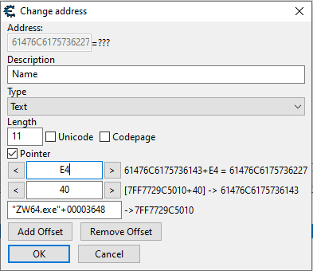

# Overview

## About The Project

Helper library for external windows game hacking.

Collaborative work provided by the <a href="https://discord.gg/CRMQq4F" target="_blank">CasualCommunity</a>

## Installation

 1. Download current release ("CasualLibrary0.1.1.rar") from <a href="https://github.com/CasualCoder91/CasualLibrary/releases/" target="_blank">the release section</a>
 2. Extract *.h and *.lib file(s) at appropriate location in your project directory.
 3. Include them into your project: Use CasualLibraryd.lib for debug builds and CasualLibrary.lib for release builds.

## Documentation

The main set of documentation can be found <a href="https://casualcoder91.github.io/CasualLibrary/html/index.html" target="_blank">here</a>

## Usage

### bare-bones setup

```cpp
#include <iostream>
#include "Memory.h"

int main(){
    External::Memory memory = External::Memory("target.exe");
}
```

### read/write memory

```cpp
//works for all types including uintptr_t, int, double etc. as well as custom structs and classes.
//does NOT work for arrays/vectors
uintptr_t address = 0x2240001C;
// read integer stored at address
int test = memory.read<int>(address);
// read one word
std::string word = memory.readString(address);
//read 200 chars
std::string text = memory.readString(address, 200);
//write value 5 starting at given address
memory.write<int>(address, 5);
```

### get module base address

```cpp
uintptr_t clientAddr = memory.getModule("client.dll");
```

### get address from static pointer + offsets



```cpp
uintptr_t baseAddr = memory.getModule("ZW64.exe");
uintptr_t healthAddr = memory.getAddress(baseAddr+0x00003648, { 0x40,0xE4 });
```

### AOB Scanner

```cpp
uintptr_t address = memory.findSignatureAddress(0x7FF702CB5D00, "? 39 05 F0 A2 F6 FF" , 10000);
```
